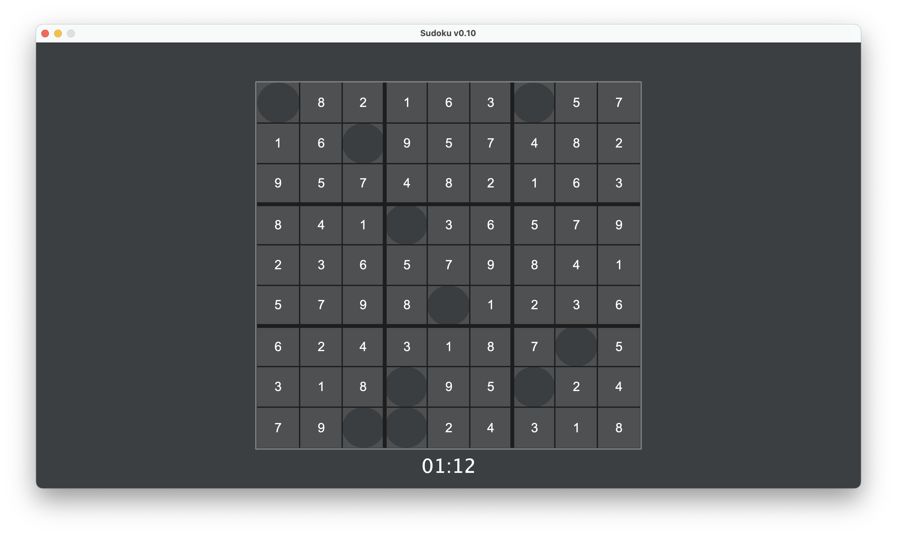

# Sudoku játék

## Leírás
Programozás alapjai 3. tárgyhoz készített nagy házi feladatom.

A program egy egyszerű sudoku játék implementációja. A játékban ki lehet választani a nehézségi szintet a kedvünk szerint
és méri a megoldáshoz szükséges időt is. A rekordokat ki lehet exportálni egy szöveges fáljba. El tudjuk menteni az éppen
aktív játékot és vissza is tudunk tölteni mentéseket régebbről.

Részletesebb leírások a [Dokumentációk](https://github.com/afkfish/Prog3-NHF/blob/main/README.md#dokumentációk) részben olvashatók.

## Dokumentációk
* [Felhasználói dokumentáció](./docs/documentation_hu.pdf "Felhasználói dokumentáció")
* [Osztályok és metódusok dokumentációja](https://afkfish.github.io/Prog3-NHF/ "Osztályok és metódusok dokumentációja")
* [Specifikáció](./docs/specification.pdf "Specifikáció")

## Képernyőképek

